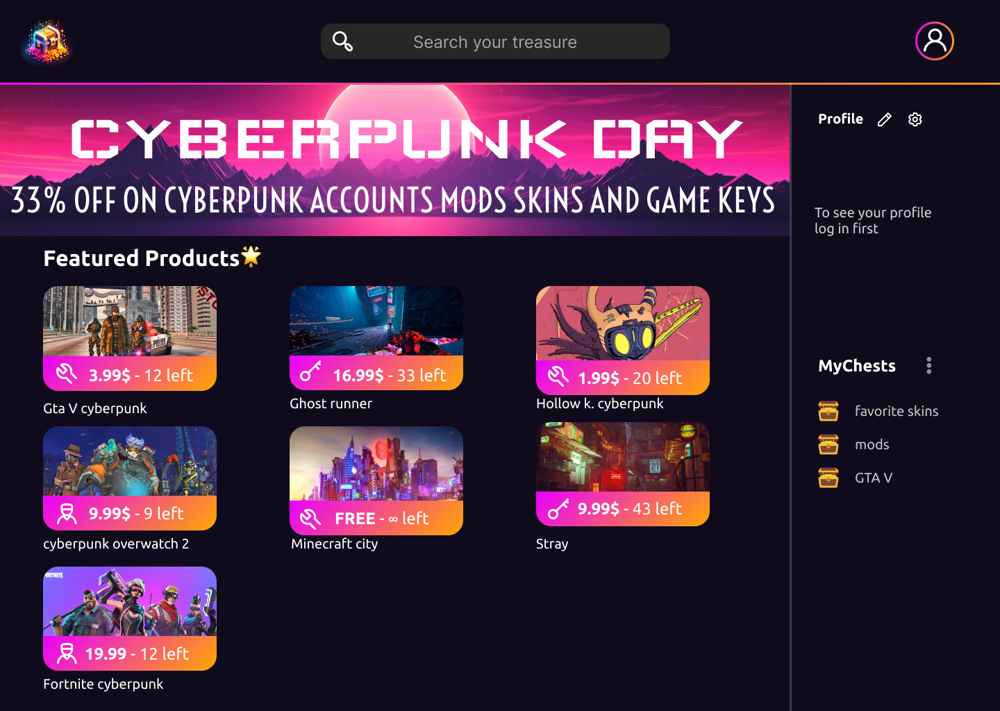

## Welcome to mychest.store: Unlock the World of Gaming
your ultimate destination for all things gaming! Whether you're looking for the latest game keys or searching for free mods to enhance your gaming experience, we've got you covered. With a wide selection of games and a constantly updated library of mods, we're here to fuel your gaming passion.

At mychest.store, we understand the thrill of discovering new games and the joy of customizing your favorite titles with mods. That's why we've created a platform that combines the convenience of purchasing game keys with the excitement of exploring a world of free mods. Get ready to unlock endless possibilities and take your gaming to the next level.

### Backend Tools:
- Spring Boot: A powerful Java framework for building backend applications. It provides a comprehensive set of features and tools to develop robust and scalable web applications.
- PostgreSQL: A popular open-source relational database management system. It offers advanced features and excellent performance for storing and retrieving data in backend applications.
- Weaviate: A knowledge graph-based search engine that allows you to build intelligent applications with natural language processing capabilities.

### Frontend Framework:
- Flutter: A cross-platform framework for building beautiful and native-like user interfaces. It enables developers to create stunning mobile, web, and desktop applications using a single codebase.

With these tools and frameworks, you can build a full-stack application that seamlessly integrates the backend functionalities with a visually appealing and responsive frontend. Enjoy the power of Spring Boot, PostgreSQL, Weaviate, and Flutter to create amazing gaming experiences for your users.